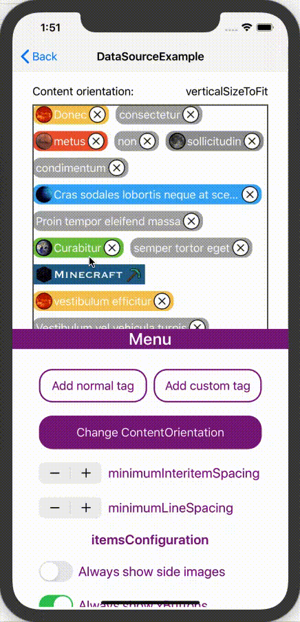

# TagsList

[](https://travis-ci.org/Anton/TagsList)
[](https://cocoapods.org/pods/TagsList)
[](https://cocoapods.org/pods/TagsList)
[](https://cocoapods.org/pods/TagsList)


<p align="center">
<b>TagList</b> allows to add a list of highly customizable tags. You can set common tags parameters, add items with unique parameters
</p>


## Example

To run the example project, clone the repo, and run `pod install` from the Example directory first.
Exaple project includes 3 parts:
- VC is 'TagsListDataSource' + customisation of items
- Simple way to display string array ('DefaultTagsListDataSource')
- Sample of using 'TagsList' inside of 'UITableViewCell' and calculating 'TagsList' height


## Preview

### Content orientation

### Items deleting

### Customisation features


## Requirements

- iOS 11.0+
- Xcode 9.0


## Installation

TagsList is available through [CocoaPods](https://cocoapods.org). To install
it, simply add the following line to your Podfile:

```ruby
pod 'TagsList'
```

## Author

!TODO: Anton, a.tekutov@inostudio.com

## License

TagsList is available under the MIT license. See the LICENSE file for more info.
